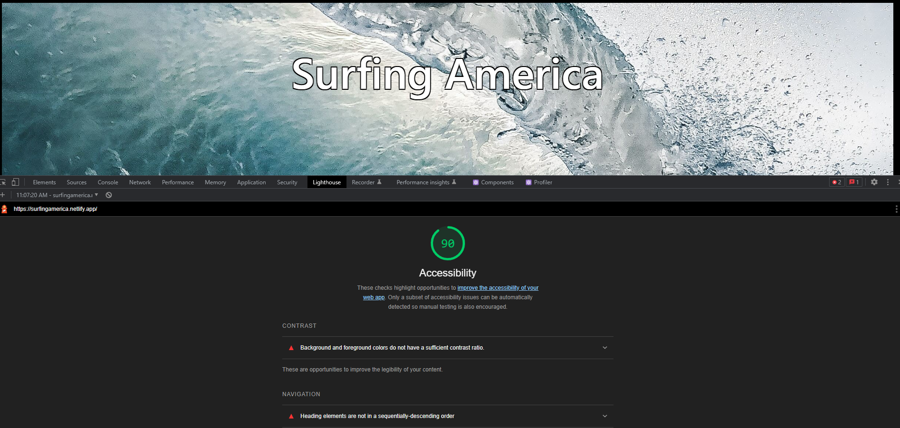

# Team Agreement

Code Fellows 301 Project Week Prep Documents

## Team Members

* Alex Carr
* Nick Brown
* Ryan Eastman
* Dasha Lewis

## Accessibility Score

### Cooperation Plan

* *Key Strengths -*

  * Alex Carr: time management, goal oriented, great team    member, css

  * Nick Brown: researching, html, css

  * Ryan Eastman: exposure to a lot of concepts, fantastic at defining the problem, very driven and dedicated to achieving goals

  * Dasha Lewis: time-management, resource management, leadership skills, team-work oriented.

* *How We Can Implement Our Strengths as a Team -*

  * Find applicable knowledge and refactor that knowledge for our project
  * Great communication and friendly rapport to talk through problems together

* *Which Professional Competencies Do We Want to Develop -*

  * Nicholas Brown: technical/craft
  * Dasha Lewis: technical/teamwork
  * Alex Carr: technical/technical
  * Ryan Eastman: teamwork/technical

* *Approach Plan for the Day-to-Day -*

  * Be available on weekdays from 0900 - 1700 PST
  * Be reachable via slack as our primary source of communication
  * Should we have to work independently, we will provide morning and evening updates to the group.

### Conflict Plan

* *What will be your group’s process to resolve conflict, when it arises?*
  * Ryan volunteered to resolve conflict with a patient and understanding neutral perspective. And if Ryan is the problem, the whole team will work as a cohesive unit to attack swiftly and mercilessly to end the threat as effectively as possible.

* *What will the team do if one person is taking over the project and not letting the other mambers contribute?*
  * We will approach the individual as a team, or elect a single representative to engage the solo worker and engage in a discussion that emphasizes the importance of teamwork.

* *How will you approach each other and the challenges of the project knowing that it is impossible for all members to be at the exact same place in understanding and skill level?*
  * Try your best, but if you feel if you don't think you're getting things done, then bring it up sooner rather than later. Ask each other for a "second eye" when you feel like you've been staring at something too long. Don't be afraid to level set, break it down barney style, draw it out, ask the question several different ways to figure out the missing link.

* *How will you raise concerns to members who are not adequately contributing?*
  * We will have 1-on-1 discussion. Responsbility will fall upon the individual who notices it first to bring up the issue immediately.

* *How and when will you escalate the conflict if your resolution attempts are unsuccessful?*
  * Should all attempts at a peaceful resolution fail, speed and violence of action will be the ultimate checkmate. But we could probably call in some help from Audrey before we resort to violence.

### Communication Plan

* *What hours will you be available to communicate?*
  * 9am to 12pm work block, 12pm to 1pm lunch break, 1pm to 5pm work block.

* *What platforms will you use to communicate (ie. Slack, phone …)?*
  * Primary Communication: Slack
  * Secondary Communication: Phone

* *How often will you take breaks?*
  * 10 minutes break every hour, use the 15 minute rule for problems.

* *What is your plan if you start to fall behind?*
  * Announce that you are falling behind sooner rather than later, consider changing up project responsbilities

* *How will you communicate after hours and on the weekend?*
  * Slack, but remember to honor our work agreement, being flexible with each other

* *What is your strategy for ensuring everyone’s voice is heard?*
  * Check in with each other in our daily team meet ups.

* *How will you ensure that you are creating a safe environment where everyone feels comfortable speaking up?*
  * Being aware, Having fun, Remembering that there is no such thing as a coding emergency, let's rely on each other to keep on the same step, incorporate code review once in awhile.

### Work Plan

* *How you will identify tasks, assign tasks, know when they are complete, and manage work in general?*
  * Trello Board

* *What project management tool will be used?*
  * Trello Board

### Presentation Deck

* Link: https://docs.google.com/presentation/d/1DE3TTW_zPF9Gd4utvoBn1Wr1k6TDEA3Xwy1tow9dss4/edit?usp=sharing

### Practice Session

* Date:
* Time:

### Git Process

* *What components of your project will live on GitHub?*

* *How will you share the repository with your teammates?*

* *What is your Git flow?*

* *Will you be using a PR review workflow? If so, consider:*
  * *How many people must review a PR?*

    * Who merges PRs?
    * How often will you merge?
    * How will you communicate that it’s time to merge?

