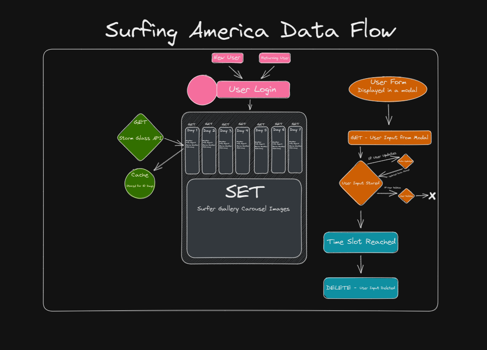

# PROJECT VISION

## What is the vision of this product?
- For user to log onto the site with their personal information and schedule a surfing appointment individual session or a group session. User can schedule a 2 hour session at a private beach. The schedule should have a user interface that allows them to add an appointment, cancel an appointment and even update an appointment. Upon page load the 7-day weather forecast will render. 
- Finally, as Surfing America to view scheduling information and insure there is no conflicts with timed blocks. The user information will be stored for later use such as scheduling conflicts or appointments to be cancel due to weather.

**User Stories:** https://trello.com/b/Uv2GdTBM/surfing-america 

## Domain Modeling: 

 

**Database:** Storm Glass API 
Property Stored: Weather, tide report, marine report, astronomy, scheduled events and user contact info. 

CallenderSchema = new Schema({
Date: { type: String, required: true },
Contact Info: { type: String, required: true },
GroupSize : { type: String, required: true },
Insurance: { type: Boolean, required: true },
Photography: { type: Boolean, required: true },
});

## What pain point does this project solve?
- We all know people that are looking for the perfect place to go surfing. With beaches being so packed now-a-days with families it is hard to get a good surf in. We can solve this with our very own private beach strictly for surfers to feel at home with other surfers.

## Why should we care about your product?
- There are hundreds of people on the daily basis that would love to get in a good surf, rather it be to clear their stressed mind and/or even just to get their daily exercise in. This can be a problem when trying to get a surf in and manage staying out of others bubble at a public beach setting. At Surfing Amercia we have provided the space where one can go and have their own time slot and a place on our private beach to rip.

## Scope (In/Out)

1. IN - What will your product do
Allow user to log onto the site with their personal information and schedule a surfing appointment, individual session or a group session. User can schedule a 2 hour session at a private beach. The schedule should have a user interface that allows them to add an appointment, cancel an appointment and even update an appointment. Upon page load the 7-day weather forecast will render. Surfing America to view scheduling information and insure there is no conflicts with timed blocks. The user information will be stored for later use such as scheduling conflicts or appointments to be cancel due to weather.

**High overview:**
- The applications aims to provide users with a platform to schedule an appointment to surf on private beach.
- Users will also have the option to delete and update appointments.
- Upon page load will render a 7-day forecast and schedules times for that day.
- The application will track and record the user log in information to help Surfing America with conflict issues. 

2. OUT - What will your product not do.
Our application is not intended to be a mobile app at this point in time.
Our application is not intended for those that do not surf.
Our application is not intended

## Minimum Viable Product vs What will your MVP functionality be?
Our MVP is a simple application where the user can schedule a 2 hour session at a private beach. The schedule will have a user interface that allows them to add an appointment, cancel an appointment and even update an appointment. Upon page load the 7-day weather forecast will render. 

## What are your Stretch goals?
- Our stretch goals are: -Provide the same avialibale beach time for other cities.

## Functional Requirements: 
1. User can create, delete and update appointments.
2. User can see weather for day of scheduled.
3. Surfing America(admin) will have user contact info for appointment cancellations. 

## Data Flow:
- User will log into application utilizing our Auth0. Once logged in the user will be faced with the opportunity to schedule, update and delete appointments that will be available. We will utilize CRUD for the process of scheduling through our application. Available upon page render will be the weather forecast this information will come directly from our backend utilizing storm glass weather API. Page will show scheduled appointment. 

## Non-Functional Requirements:
1. Usability: Regardless of the size of your business, the website of your business should be easy to use for even a non-technical user. 
2. Security: Security comes with utmost importance in our site, users’ log in with sensitive data and APi Keys can be used by others. 
- Our Non-Functional requirements are very important for the purpose of our Page. The usability Is an aspect to be aware of because we want to ensure that users can log on and fulfil any requirements. Security is a major important aspect there are cyber security issue all the time, so it is important that we protect the user info and our own. 
